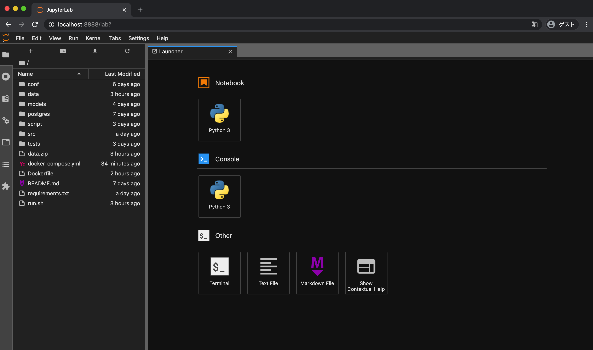
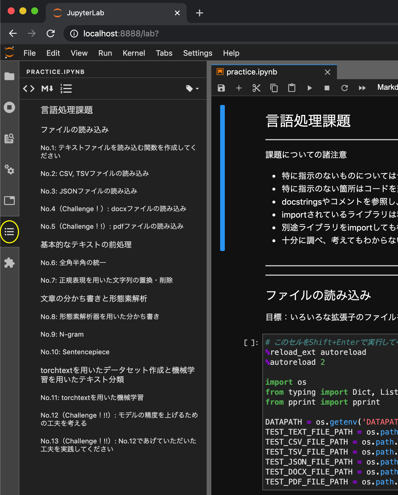
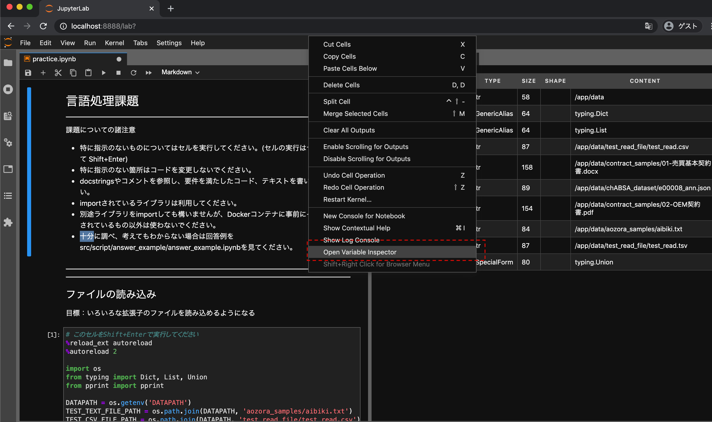

# Let's practice Natural Language Processing!
- 日本語の言語処理を中心に一通り練習できる環境をDockerで提供します。
- 実問題に近い形で、ファイル読み込み、テキスト前処理、形態素解析、機械学習のスキルの習得を目標に問題を作成しています。
- script内に練習用の課題があるので、順番に問いてみましょう。
- 正解例はsript内のanswer_example内にあるので答え合わせもできます。

---
## Requirements
- Docker: https://docs.docker.com/get-docker/
- Docker Compose: https://docs.docker.com/compose/install/

---
## Setup
クローンしてきたフォルダ内に移動してから、以下を実行してください。
1. 環境設定ファイルを作成します。必要に応じて.envファイルの内容を書き換えてください。
```
cp .env.org .env
```
1. イメージをビルドしますします。(5~10分程度時間がかかります。)
```
docker-compose build --no-cache
```

---
## Usage
1. ビルドしたイメージからコンテナを立ち上げます。
```
docker-compose up -d --no-recreate
```

2. コンテナ内でJupyterLabが立ち上がるのでChromeなどのブラウザに `localhost:8888` と入力する。


3. 課題を始める場合は左側のメニューから `script/practice` に移動して `practice.ipynb` をダブルクリックで開く。

4. 課題の回答例は `script/answer_example` にあります。

5. 終了時はJupyterLabを閉じて、コンテナを終了してください。
```
dokcer-compose down
```

6. 再度コンテナを立ち上げる場合は上記1のコマンドを実行してください。

---
## Useful
- ipynbを開いて、左側のメニューの下から2つ目のアイコンをクリックすると目次が表示され、該当箇所にジャンプできます。



- 右クリックでメニューを開いて `Open Variable Inspector` で定義した変数を確認することができます。



---
## Environment of Container
- OS: Debian
- Python 3.7
- Jupyter Lab

---
## NLP Packages

形態素解析器
- Janome（MeCabベース）
- Ginza（Sudachiベース）: https://megagonlabs.github.io/ginza/

Tokenizer
- Sentencepiece

Machine Learning
- scikit-learn

Deep Learning
- pytorch: https://pytorch.org/docs/stable/

テキスト前処理系
- torchtext: https://pytorch.org/text/
- mojimoji
- nltk

File Reader
- pdfminer.six
- python-docx

---
## Docs
- Docker: https://docs.docker.jp/index.html
- Docker Compose: https://docs.docker.jp/compose/toc.html
- JupyterLab: https://jupyterlab.readthedocs.io/en/stable/